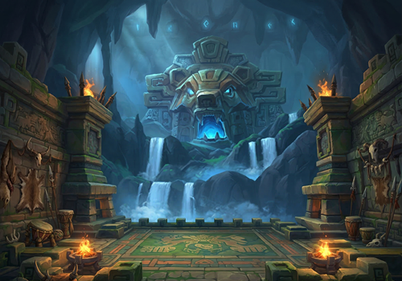
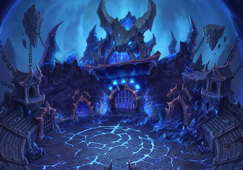
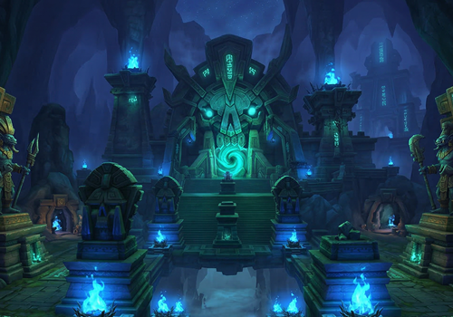
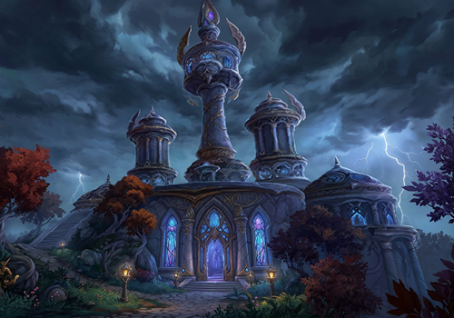
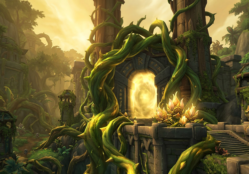
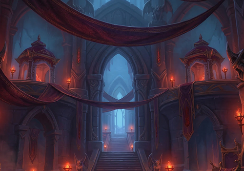
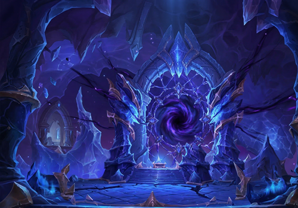
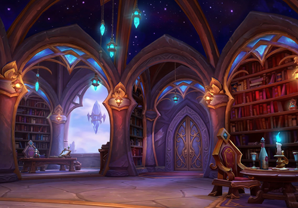

import { CardGrid, Card } from '@astrojs/starlight/components';
import { Tabs, TabItem } from '@astrojs/starlight/components';

## Donjons de la Saison

<CardGrid>
  <a href="./donjons/midnight/s0/antre-nalorakk" style="text-decoration: none;">
    <Card title="Antre de Nalorakk (in progress)">
      
    </Card>
  </a>

  <a href="./donjons/midnight/s0/arene-cicatrice" style="text-decoration: none;">
    <Card title="Arène de la cicatrice du vide (in progress)">
      
    </Card>
  </a>

  <a href="./donjons/midnight/s0/caverne-maisara" style="text-decoration: none;">
    <Card title="Caverne de Maisara (in progress)">
      
    </Card>
  </a>

  <a href="./donjons/midnight/s0/fleche-coursevent" style="text-decoration: none;">
    <Card title="Flèche de Coursevent (in progress)">
      
    </Card>
  </a>

  <a href="./donjons/midnight/s0/val-aveuglant" style="text-decoration: none;">
    <Card title="Le val aveuglant (in progress) ">
      
    </Card>
  </a>

  <a href="./donjons/midnight/s0/allee-meurtre" style="text-decoration: none;">
    <Card title="L'allée du meurtre (in progress)">
      
    </Card>
  </a>

  <a href="./donjons/midnight/s0/point-nexus" style="text-decoration: none;">
    <Card title="Point-Nexus Xenas (in progress)">
      
    </Card>
  </a>

  <a href="./donjons/midnight/s0/magister-terrace" style="text-decoration: none;">
    <Card title="Terrasse du Magistère">
      
    </Card>
  </a>
</CardGrid>